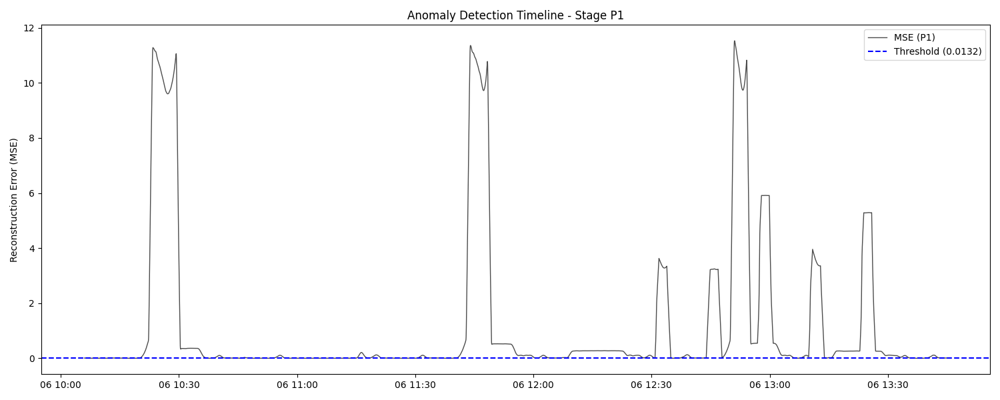
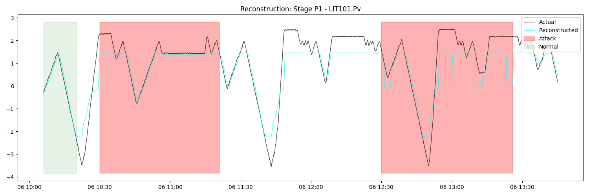
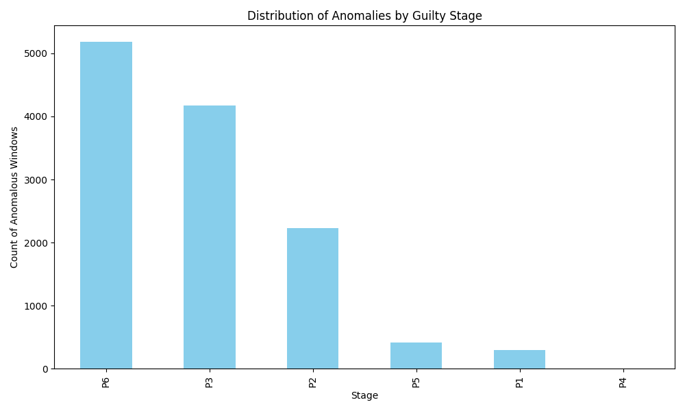
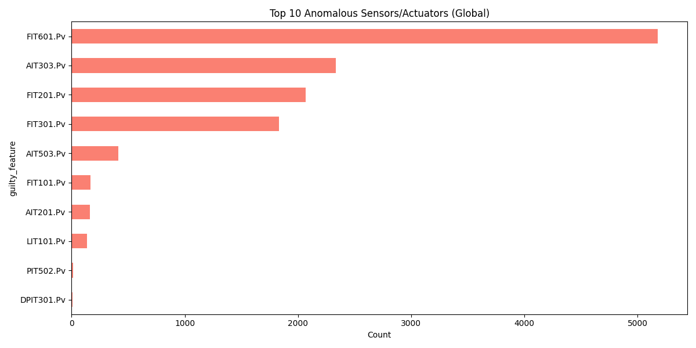
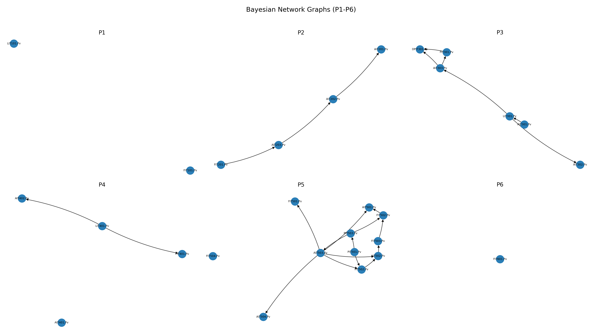
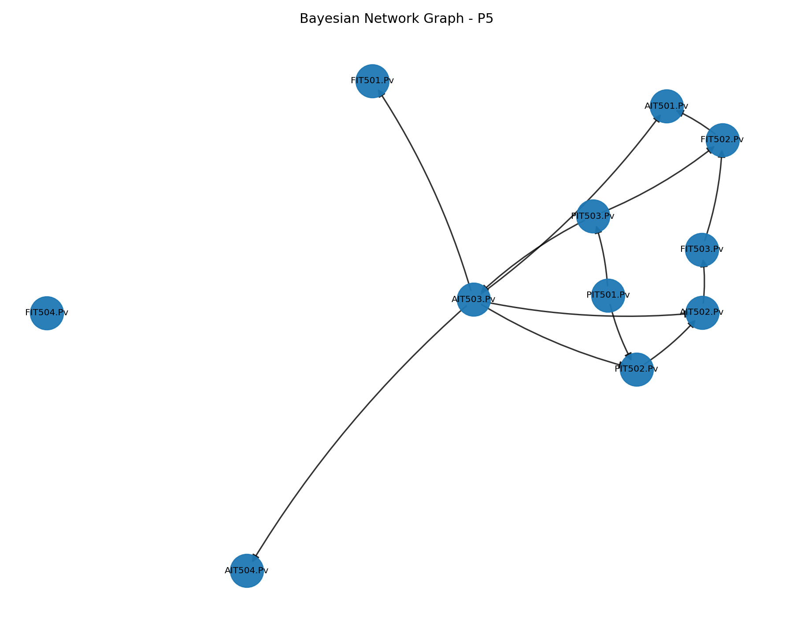

# SWaT Anomaly Detection Project

This repository implements a stage-wise anomaly detection and root cause analysis pipeline for the Secure Water Treatment (SWaT) dataset. It combines preprocessing, time-window modeling with LSTM autoencoders, reconstruction-based RCA, Bayesian Network learning, Bayesian RCA, local LLM-based path validation, and temporal consistency evaluation of propagation paths.

Project presentation slides are available in the `presentation_slides` folder.

## Documentation

- [INFO.md](INFO.md): Data reference for SWaT, plant stages `P1` to `P6`, variable naming, and the exact variables used in this project.
- [CODE.md](CODE.md): Code reference for `step1.py` through `step15.py`, including pipeline logic, dependencies, inputs, outputs, and storage paths.
- [CONTEXT_COMPACT.md](CONTEXT_COMPACT.md): Compact repository context distilled from `INFO.md` and `CODE.md` for low-token LLM grounding.
- [RESULTS.md](RESULTS.md): Result reference covering generated plots, RCA outputs, Bayesian Network visualizations, LLM and temporal-evaluation outputs, and how to inspect outputs systematically.
- [presentation_slides](presentation_slides): Project presentation slide deck.

Use these files as the primary detailed documentation, and the compact context helper when needed:

- go to [INFO.md](INFO.md) for data and domain context
- go to [CODE.md](CODE.md) for implementation details
- go to [RESULTS.md](RESULTS.md) for outputs, graphs, and interpretation

## Setup

Set up the environment locally:

1.  **Clone the Repository**
    ```bash
    git clone <repository_url>
    cd RFC
    ```

2.  **Create a Virtual Environment (Optional but Recommended)**
    ```bash
    # Windows
    python -m venv venv
    .\venv\Scripts\activate

    # Linux/Mac
    python3 -m venv venv
    source venv/bin/activate
    ```

3.  **Install Dependencies**
    Ensure you have the required packages installed.
    ```bash
    pip install -r requirements.txt
    ```

## Repository Structure

```
RFC/
├── CONTEXT_COMPACT.md # Compact context used by the chatbot prompt grounding
├── chatbot.py           # Streamlit RCA chatbot over static Step16 outputs
├── data/
│   ├── processed/      # Generated data files (steps 2-16)
│   └── raw/            # Original input data
├── models/
│   └── lstm/           # Saved PyTorch model checkpoints (.pt)
├── reports/
│   └── figures/        # Generated plots and visualizations
├── presentation_slides/ # Project presentation slide deck
├── notebooks/          # Python scripts for each step of the pipeline
│   ├── step1.py
│   ├── ...
│   ├── step13.py
│   ├── step14.py
│   ├── step15.py
│   ├── step16.py
│   └── graph_view.py
├── weaviate_explorer.py   # CLI utility for exploring/exporting RCA results from Weaviate
└── README.md
```

## Pipeline Summary

The main pipeline is organized in five layers:

1. Data preparation: steps 1 to 6 clean the SWaT table, normalize process values, create windows, and split data by stage.
2. Detection and classical RCA: steps 7 to 10 train LSTM autoencoders, compute anomaly scores, identify guilty stages and features, and generate summary figures.
3. Causal modeling: steps 11 and 12 learn stage-wise Bayesian Networks and use them for graph-based root cause analysis.
4. LLM path validation: step 13 uses a local Ollama model to evaluate whether candidate propagation paths are plausible.
5. Temporal consistency evaluation: steps 14 and 15 compute time-ordering scores for propagation paths and generate temporal diagnostics and plots.

Additionally, this repository includes an interactive analysis layer:

1. Step16 chatbot interface: `chatbot.py` serves a Streamlit chat app grounded on `data/processed/step16/llm_explanations.csv`, with deterministic ranking queries and optional Groq-backed narrative explanations.

## Key Scripts

| File | Description |
|------|-------------|
| `notebooks/step1.py` to `notebooks/step6.py` | Data preparation, metadata extraction, normalization, windowing, and stage splitting |
| `notebooks/step7.py` | Stage-wise LSTM autoencoder training |
| `notebooks/step8.py` | Inference, anomaly scoring, and reconstruction plots |
| `notebooks/step9.py` | Reconstruction-based root cause analysis |
| `notebooks/step10.py` | RCA summary visualizations |
| `notebooks/step11.py` | Bayesian Network learning and Weaviate graph export |
| `notebooks/step12.py` | Bayesian root cause analysis |
| `notebooks/step13.py` | Local LLM evaluation of candidate propagation paths |
| `notebooks/step14.py` | Temporal consistency evaluation of propagation paths |
| `notebooks/step15.py` | Temporal diagnostics and visualization for propagation paths |
| `notebooks/step16.py` | Builds merged RCA + temporal + LLM explanations output for chatbot grounding |
| `notebooks/graph_view.py` | Bayesian graph rendering to images |
| `chatbot.py` | Interactive Streamlit chatbot over static Step16 RCA outputs |

## Stage Reference

- `P1`: Raw Water Intake
- `P2`: Pre-treatment
- `P3`: Ultra-Filtration
- `P4`: De-Chlorination
- `P5`: Reverse Osmosis
- `P6`: Disposition

For the full SWaT variable reference, naming conventions, and exact stage-wise variables used in this repository, see [INFO.md](INFO.md).

## How to Run

Run the scripts in order because each step depends on artifacts from earlier steps.

Navigate to the `notebooks` directory:
```bash
cd notebooks
```

1.  **Run Step 1 to Step 16 sequentially:**
    ```bash
    python step1.py
    python step2.py
    python step3.py
    python step4.py
    python step5.py
    python step6.py
    python step7.py
    python step8.py
    python step9.py
    python step10.py
    python step11.py
    python step12.py
    python step13.py
    python step14.py
    python step15.py
    python step16.py
    ```

2.  **Optional: render Bayesian Network graph images**
    ```bash
    python graph_view.py
    ```

3.  **Optional: run the chatbot app from project root**
    ```bash
    cd ..
    python -m streamlit run chatbot.py
    ```

    To enable Groq responses, set environment variable `GROQ_API_KEY` before starting Streamlit.

## Requirements Files

- requirements.txt: Main dependencies for running the pipeline and chatbot interface.
- requirements-models.txt: Additional dependencies for model training, advanced analytics, or optional features.

## Visual Results

For the full result walkthrough, quantitative summaries, and output directory guide, see [RESULTS.md](RESULTS.md). The figures below show the main outputs directly in the README.

### 1. Anomaly Timeline

Example stage-level anomaly score timeline with the learned threshold.


### 2. Reconstruction Comparison

Actual versus reconstructed process value for one representative feature.


### 3. Root Cause Analysis

Stage distribution of detected anomalous windows.


Most frequent guilty features across the detected anomalies.


### 4. Bayesian Network Overview

Learned Bayesian Network graphs for stages `P1` through `P6`.


### 5. Detailed Bayesian Graph (Stage P5)

Stage `P5` has the richest learned causal graph in the current repository outputs.


## Where To Inspect Results

- `reports/figures`: anomaly timelines, reconstructions, RCA summary plots, and temporal evaluation figures
- `reports/figures/bn_graphs`: stage-wise Bayesian Network graph images
- `presentation_slides`: project presentation slide deck
- `data/processed/step8`: reconstruction-based RCA CSV and anomaly JSON
- `data/processed/step11`: learned Bayesian Network JSON files
- `data/processed/step12`: Bayesian RCA CSV output
- `data/processed/step13`: LLM-based propagation path evaluation CSV
- `data/processed/step14`: temporal consistency evaluation CSV and summary JSON
- `data/processed/step15`: temporal analysis tables and summary JSON
- `data/processed/step16`: merged RCA + temporal + LLM explanation table used by `chatbot.py`

## Hosted Chatbot

You can try the interactive RCA chatbot online:

- [chatbot.py Streamlit app](https://rfc-chatbot.streamlit.app/)

_Note: If the app has been idle, it may take up to 60 seconds to wake up._
